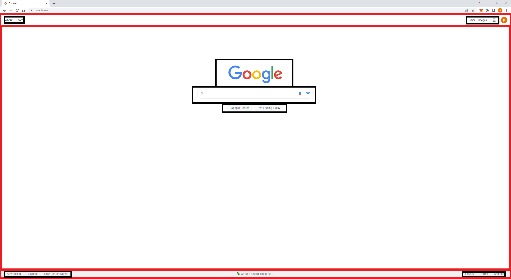

# Google Homepage Replica using HTML and CSS

This project is a replica of the Google homepage created using HTML and CSS. It uses Font Awesome icons for the search, microphone, and camera icons.

## Approach
To replicate the Google homepage, I first used Google Chrome's Inspect feature to analyze the structure and styles of the original page - Google. I then decided to break it down into three main components: 

- Navbar: This section includes links to About, Store, Gmail, Images, and a hamburger icon.
- Main: This section contains the Google logo, search box with search icon, microphone icon, and camera icon. Below the search box, there are two buttons: one is for Google Search and the other is for "I'm Feeling Lucky."
- Footer: This section includes links to other Google services.

## Installation

1. Clone the repository to your local machine.
2. Open the `index.html` file in a web browser like Google Chrome.

## Usage

This project is a static website replica of the Google homepage. You can interact with it in the same way you would with the original Google homepage.

## Credits

- The Font Awesome icons used in the project were sourced from [fontawesome.com](https://fontawesome.com).
- The original Google homepage was used as a reference for the project.

## Author

Created by [rsp0225].
